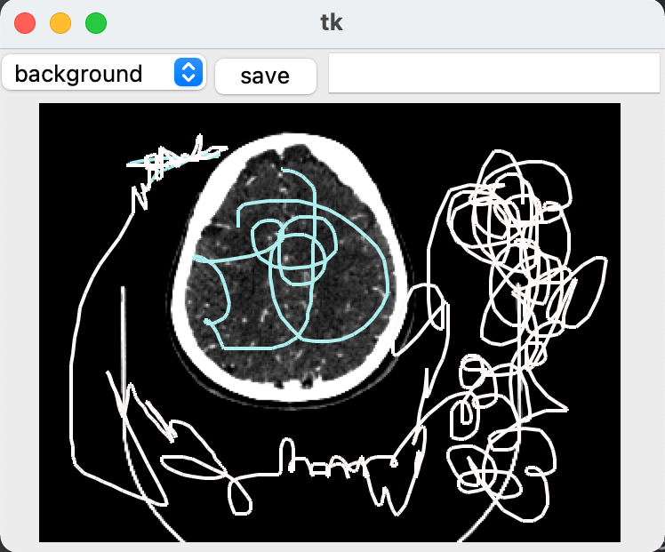

# scribble_segmentation

In this project we suggest a method for weakly supervised segmentation based on scribbles and combine it with active learning methods.

## How to use:
1. Start off by updating the classes list, names and dictionary in the [constants.py](constants.py) file.
2. Either generate a pool directory from a CT volume using [generate_demo_set.py](generate_demo_set.py) or prepare a 
directory of images. Each image in the pool folder should have an 'image' prefix
3. Set your environment to run two processes in parallel 
4. Run the [gui.py](gui.py)
gui.py file

